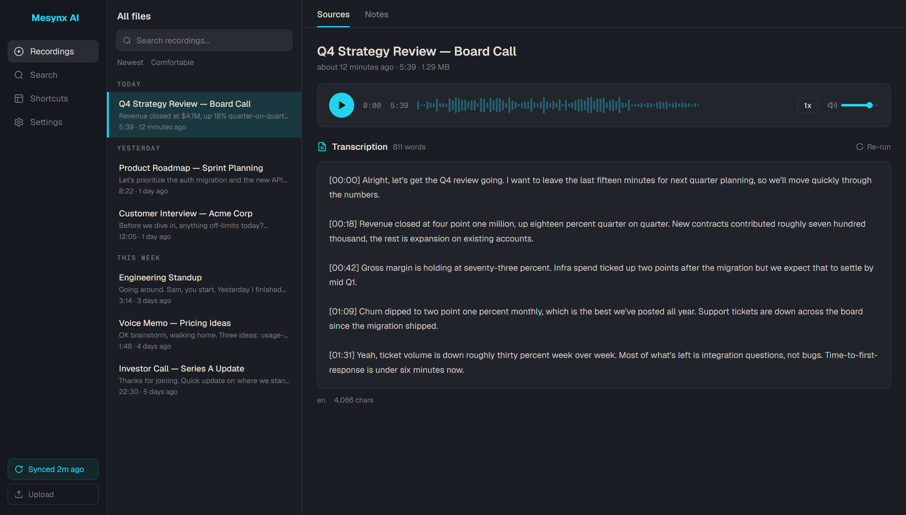
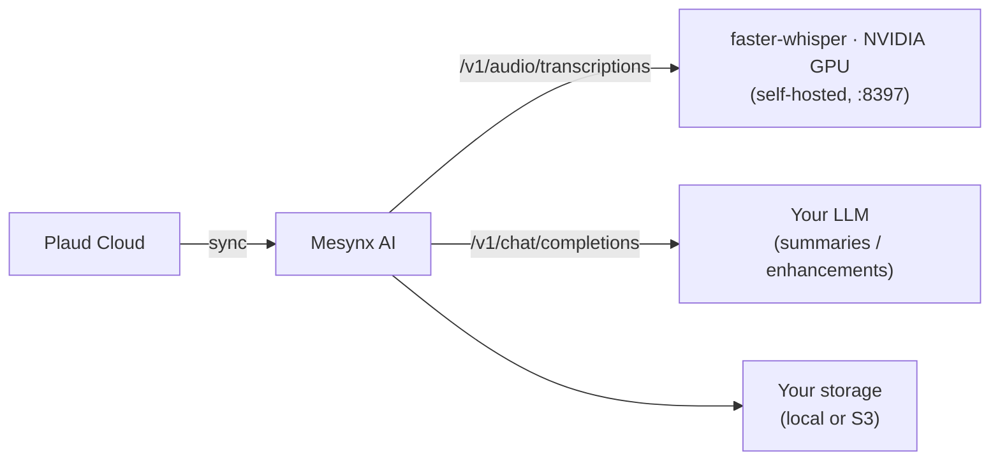
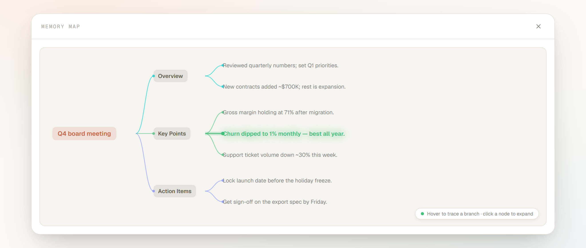
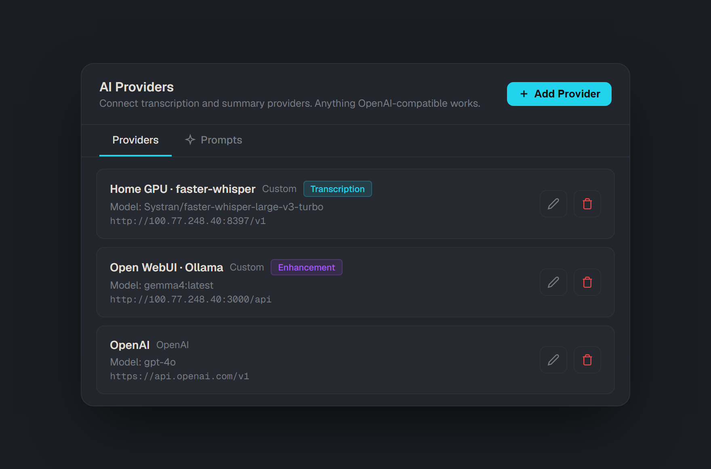
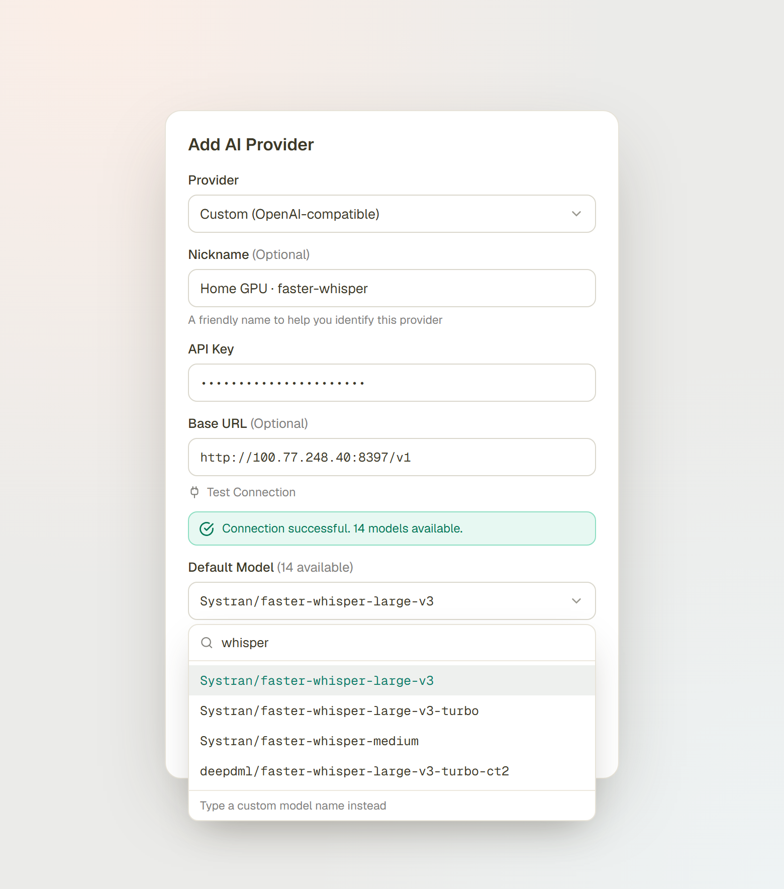

<div align="center">


**Open-source AI transcription companion for voice recorders.**

*Bring your own AI provider, own your transcripts, self-host or hosted.*

[](LICENSE)
[](https://mesynx.r0073dl053r.com/discord)

[Quick start](#quick-start) • [What's new vs. Riffado](#whats-new-in-mesynx-ai-vs-riffado) • [Documentation](https://mesynx.r0073dl053r.com/docs) • [Discord](https://mesynx.r0073dl053r.com/discord)

</div>

---

> **Mesynx AI is a self-hosting-first distribution of [Riffado](https://github.com/riffado/riffado)** (which was formerly *OpenPlaud*). It tracks Riffado's core and adds first-class **self-hosted GPU transcription**, a redesigned **Memory Map**, and hardened **AI-provider management**. Same AGPL-3.0 license as its upstream. [See exactly what's different ↓](#whats-new-in-mesynx-ai-vs-riffado)

Mesynx AI is an open-source companion app for AI voice recorders. It syncs your recordings from the manufacturer's cloud, transcribes them with any OpenAI-compatible API — **a remote provider, the browser for free, or your own GPU** — and stores everything on infrastructure you control. **Currently supports the Plaud Note family — Note, Note Pro, and NotePin. More device support on the way.** AGPL-3.0.



## Features

- **Self-hosted GPU transcription** — a bundled [faster-whisper](https://github.com/SYSTRAN/faster-whisper) service (NVIDIA), turnkey in Docker Compose. No external API required. *(New in Mesynx AI.)*
- **Interactive Memory Map** — every recording's summary, key points, and action items as a navigable mind-map. *(Redesigned in Mesynx AI.)*
- Works with any OpenAI-compatible provider — OpenAI, Groq, OpenRouter, Together, LM Studio, Ollama, Azure, anything with a `baseURL`.
- Free browser transcription via Transformers.js (Whisper in WebAssembly).
- Self-hosted. Your recordings, your storage, your API keys.
- Local filesystem or S3-compatible storage (AWS S3, Cloudflare R2, MinIO, Backblaze B2, DigitalOcean Spaces, Wasabi).
- AES-256-GCM encryption at rest for tokens, API keys, transcripts, and summaries.
- Auto-sync on a schedule, with browser and email notifications.
- Full export and backup — JSON, TXT, SRT, VTT, plus one-archive backup/restore.
- Automation API with signed webhooks for integrations.
- Zero-config Docker Compose deploy.

## What's new in Mesynx AI (vs. Riffado)

Everything Riffado does, Mesynx AI does too — these are the changes layered on top.

| Area | Riffado | Mesynx AI |
|---|---|---|
| **Transcription backend** | Bring-your-own OpenAI-compatible API | **+ Bundled self-hosted GPU Whisper** service (NVIDIA), turnkey in `docker-compose.yml` |
| **Local AI servers** | Chat / text only (Ollama, Open WebUI) — `405` on `/v1/audio/transcriptions` | Real `/v1/audio/transcriptions` via faster-whisper — **your local box can finally transcribe** |
| **Memory Map** | None | **Interactive mind-map** — hover-to-trace a branch, click a node to expand, full-screen modal |
| **Provider setup** | Provider + key + model | **+ Nickname** per server · **+ searchable model picker** (auto-discovered on *Test Connection*) |
| **Provider reliability** | Saved configs occasionally failed to load / lost the key on open | Section self-loads with a spinner; **configs and keys load reliably** |
| **Brand** | Riffado (formerly OpenPlaud) | **Mesynx AI** |

### 🎙️ Self-hosted GPU transcription

Riffado expects an OpenAI-compatible transcription endpoint. The catch: popular *local* AI servers like **Ollama** and **Open WebUI** only implement chat/completions — they return **`405 Method Not Allowed`** on `/v1/audio/transcriptions`, so they can't transcribe audio at all.

Mesynx AI closes that gap by bundling a GPU [faster-whisper](https://github.com/fedirz/faster-whisper-server) service that speaks the OpenAI audio API natively:

```yaml
# docker-compose.yml (already included)
whisper:
  image: fedirz/faster-whisper-server:latest-cuda
  container_name: mesynx-ai-whisper
  restart: unless-stopped
  ports:
    - "8397:8000"
  deploy:
    resources:
      reservations:
        devices:
          - driver: nvidia
            count: all
            capabilities: [gpu]
```

Then point a provider's **Base URL** at it — `http://whisper:8000/v1` from inside Compose, or `http://<host>:8397/v1` from another machine on your network.



Running it on a separate GPU box is supported too — see [`whisper-server/`](whisper-server/) for a standalone compose file plus **model selection and anti-hallucination (VAD) guidance** for long recordings.

### 🧠 Interactive Memory Map

Each recording's AI summary becomes a navigable mind-map — **Overview**, **Key Points**, and **Action Items** branch out from the title, color-coded per branch. Hover any node to trace its lineage; click a leaf to expand the full text; hit **Show full map** for a focused, full-screen view. The layout engine was rebuilt to eliminate the label overlap from Riffado's version.



### 🔌 Hardened AI provider management

- **Nickname any server.** Custom and self-hosted endpoints get a friendly label, so "Home GPU · faster-whisper" beats squinting at a base URL.
- **Searchable model picker.** Run **Test Connection** and Mesynx AI discovers the server's models, then offers a type-to-filter dropdown instead of a blank text box — no more guessing exact model IDs.
- **Reliable loading.** The Providers section now fetches its own data on open (with a loading state), fixing the Riffado race condition where saved configs — or their API keys — sometimes failed to appear.

<p align="center">

</p>
<p align="center">

</p>

## Quick start

You need Docker, a Plaud account at [plaud.ai](https://plaud.ai), and (optionally) an OpenAI-compatible API key. For GPU transcription you'll also want NVIDIA drivers + the [NVIDIA Container Toolkit](https://docs.nvidia.com/datacenter/cloud-native/container-toolkit/latest/install-guide.html).

**One-liner (Linux / macOS):**

```bash
curl -fsSL https://mesynx.r0073dl053r.com/install.sh | sh
```

Prompts for an install directory and `APP_URL`, downloads `docker-compose.yml` and `.env`, generates secrets, starts the stack, and waits for `/api/health`. Source: [`scripts/install.sh`](scripts/install.sh).

**Manual install:**

```bash
mkdir mesynx-ai && cd mesynx-ai
curl -fLO https://github.com/mesynx-ai/mesynx-ai/releases/latest/download/docker-compose.yml
curl -fL  https://github.com/mesynx-ai/mesynx-ai/releases/latest/download/env.example -o .env

# Generate secrets, paste into .env
echo "BETTER_AUTH_SECRET=$(openssl rand -hex 32)"
echo "ENCRYPTION_KEY=$(openssl rand -hex 32)"

docker compose up -d
```

Open <http://localhost:3000/register> and create your account. The onboarding wizard handles Plaud connection, AI providers, storage, and sync preferences.

**Upgrade:** `docker compose pull && docker compose up -d`. Migrations run on container start.

Full install guide, version pinning, image tags, and Windows/WSL notes: [mesynx.r0073dl053r.com/docs/self-hosting/install](https://mesynx.r0073dl053r.com/docs/self-hosting/install).

> `main` is a rolling integration branch. Deploy from tagged image releases, not by building `main`. See [BRANCHING.md](BRANCHING.md).

## Connecting Plaud

Mesynx AI signs into Plaud using your email — the same OTP flow as the official app. The verification code is forwarded directly to Plaud and never stored. Your access token is encrypted with AES-256-GCM before hitting the database. Region (Global, EU, APAC) is auto-detected.

If you signed up to Plaud with **Continue with Google** or **Continue with Apple**, the email-code flow won't return any recordings — that's a different identity on Plaud's side. Use the [Mesynx AI Connector browser extension](https://github.com/mesynx-ai/connector), or paste a token manually. Full instructions: [mesynx.r0073dl053r.com/docs/guides/connect-plaud-account](https://mesynx.r0073dl053r.com/docs/guides/connect-plaud-account).

> Every line that handles your credentials is open source — [send-code route](src/app/api/plaud/auth/send-code/route.ts) · [verify route](src/app/api/plaud/auth/verify/route.ts) · [encryption](src/lib/encryption.ts).

## Documentation

Everything lives at **[mesynx.r0073dl053r.com/docs](https://mesynx.r0073dl053r.com/docs)**. Direct links:

- [Install & first run](https://mesynx.r0073dl053r.com/docs/self-hosting/install)
- [Self-hosted GPU transcription (Whisper)](whisper-server/) — model selection + VAD for long recordings
- [Environment variables](https://mesynx.r0073dl053r.com/docs/self-hosting/environment-variables)
- [Upgrading](https://mesynx.r0073dl053r.com/docs/self-hosting/upgrading)
- [S3-compatible storage](https://mesynx.r0073dl053r.com/docs/self-hosting/storage-s3)
- [Email / SMTP](https://mesynx.r0073dl053r.com/docs/self-hosting/email-smtp)
- [Connect your Plaud account](https://mesynx.r0073dl053r.com/docs/guides/connect-plaud-account)
- [AI providers](https://mesynx.r0073dl053r.com/docs/guides/ai-providers)
- [Backup & restore](https://mesynx.r0073dl053r.com/docs/guides/backup-and-restore)
- [Notifications](https://mesynx.r0073dl053r.com/docs/guides/notifications)
- [Automation & webhooks](https://mesynx.r0073dl053r.com/docs/guides/automation-and-webhooks)
- [Public API reference](https://mesynx.r0073dl053r.com/docs/reference/public-api)
- [Encryption at rest](https://mesynx.r0073dl053r.com/docs/reference/encryption-at-rest)
- [Security model](https://mesynx.r0073dl053r.com/docs/reference/security-model)
- [Architecture](https://mesynx.r0073dl053r.com/docs/reference/architecture)

## Contributing

Bug reports, feature requests, and PRs welcome. See [CONTRIBUTING.md](CONTRIBUTING.md) for local setup and the PR workflow, [BRANCHING.md](BRANCHING.md) for the release model, and [CHANGELOG.md](CHANGELOG.md) for version history.

## Security

Found a vulnerability? See [SECURITY.md](SECURITY.md) for disclosure.

## License

AGPL-3.0 — see [LICENSE](LICENSE). Free to use, modify, and self-host. If you run a modified version as a network service, you must publish your source. As a derivative of Riffado, Mesynx AI carries the same license and its source obligations upstream.

## Disclaimer

- **Not affiliated.** Mesynx AI is an independent open-source project. It is not affiliated with, endorsed by, or sponsored by Plaud Inc. or any of its subsidiaries. "Plaud" and related marks are the property of their respective owners and are used here only for descriptive interoperability purposes (nominative fair use).
- **Third-party devices and services.** Mesynx AI is designed to interoperate with hardware and services from third parties that users choose to connect — including recording devices (such as Plaud) and storage and AI providers. Users are solely responsible for complying with the applicable terms of service, acceptable-use policies, and laws governing any third-party device or service they connect to this software.

## Acknowledgments

Built on **[Riffado](https://github.com/riffado/riffado)** (originally *OpenPlaud*), created by **Perier** and its contributors. Mesynx AI extends that work with self-hosted GPU transcription, the redesigned Memory Map, and provider-management improvements.
